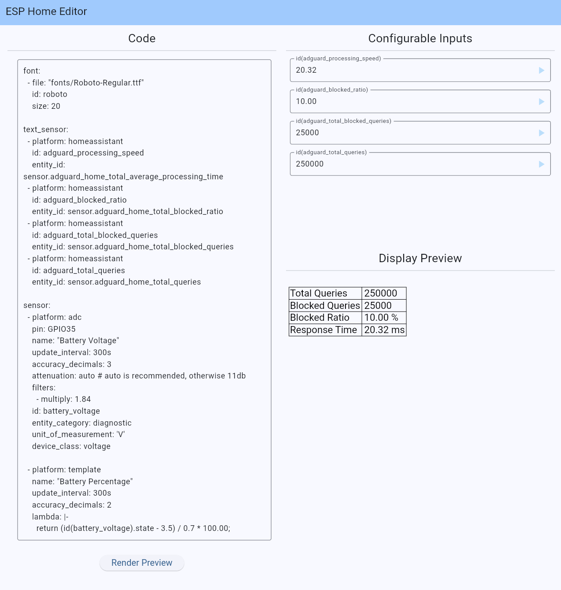

# ESPHome Display Editor
Editor for ESPHome display code that gives a preview of your display code.
Sensors and variables can be configured by the user.

This is a local interpreter written in _dart_ and _flutter_ that inteprets
your ESPHome code. You can use it at [esphome-display-editor.writerit.nl](esphome-display-editor.writerit.nl)

## Implemented ESPHome APIs

Because this is an interpreter all the APIs used by ESPHome in the lambdas, and
in general the Yaml need to be implemented.

Right now a limited number of APIs is fully implemented, and some are still lacking.
If you find an API that is not implemented yet and is not yet reported as an issue,
feel free to add it to the list. If it already exist as an issue you can add a +1 to 
indicate that you'd like to see it implemented.

The current APIs that are implemented are:

|API|Support|
|---|---|
|Line|Full|
|Triangle|Full  |
|Rectangle|Full   |
|Circle|Full|
|Text Sensors|Full|
|Colors|Partially (Not all ways of defining color are tested)|
|Print| Full|
|Printf| Partially (Might be buggy with some input types right now)|
|Font| Barebones (Only uses Roboto font right now, sizing works however)|
|Regular Polygon| Broken (Barebones are there, most of it does not work)|
